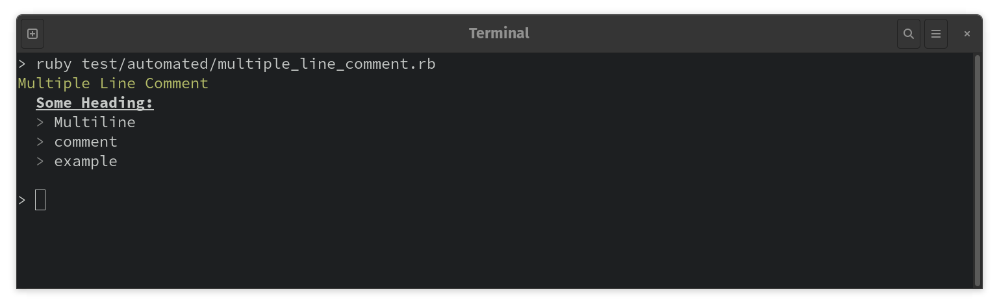

# TestBench

TestBench is a principled test framework for Ruby aiming to offer precisely what is needed to test well-designed code effectively and easily. For more information, visit TestBench's website: [http://test-bench.software](http://test-bench.software).

## Getting Started

### Installation

#### Via RubyGems

``` bash
> gem install test_bench
```

#### Via Bundler

``` ruby
# Gemfile
source 'https://rubygems.org'

gem 'test_bench', group: :development

# Or

group :development do
  gem 'test_bench'
end
```

### Initialize TestBench

Place a test initialization file at test/test_init.rb.

``` ruby
# test/test_init.rb

# Load the code to be tested
require_relative '../lib/my/code.rb'

# Load TestBench
require 'test_bench'

# Activate TestBench
TestBench.activate
```

Activating TestBench with `TestBench.activate` makes the core DSL available in test files.

The effect of activating TestBench is very limited. It adds TestBench's core API methods to Ruby's `main` object, which is the Ruby script runner. Activating TestBench has no effects on any other objects or classes in the Ruby system except for the `main` script runner.

It's not strictly necessary to activate TestBench in order to use it. See the [Using TestBench Without Monkey Patching](/user-guide/recipes.md#use-testbench-without-monkey-patching) recipe for specifics.

### Load the Test Initialization File

At the top of every test file, load the `test_init.rb` file.

``` ruby
# test/automated/some_test.rb

require_relative '../test_init'

context "Some Example" do
  test "Some test" do
    assert(true)
  end
end
```

## Running Tests

TestBench doesn't require the use of any special test runner. It's designed so that tests can be executed using nothing more than Ruby. There's no need to create or maintain plugins for editors or CI servers. It's just Ruby.

### Using the Ruby Executable

Run test files like any script file by passing the file name to the `ruby` command.

```
> ruby test/automated/example.rb
Example Context
  Some passing test
  Some other passing test
  Some failing test
    Assertion failed

Failure: 1

```

### Batch Runner

Runs a batch of files and directories. The optional parameter `exclude` can be a shell wildcard pattern that the runner will use to ignore specific files.

```ruby
TestBench::Run.('some/test/directory', exclude: nil)
```

Here is an example of the batch runner being invoked from a file named `automated.rb` located in the `test` directory. Files that begin with an
underscore, or include the word "sketch," or end in either "_tests.rb" or "_init.rb" will not be run:

```ruby
# test/automated.rb

TestBench::Run.('test/automated', exclude: '{_*,*sketch*,*_init,*_tests}.rb')
```

For more information on the batch runner, visit its [documentation page](http://test-bench.software/user-guide/running-tests.html#batch-runner).

### Command Line Runner

In addition to being able to run tests using the raw `ruby` executable, TestBench also provides its own command line executable that offers a bit more power.

The `bench` executable can be used to run individual test files or directories containing test files.

#### Running a Single File

To run a single test file, specify the file path as a command line argument.

``` bash
> bench test/automated/some_test.rb
```

#### Running a Directory

To run a directory of test files, and its subdirectories, specify the directory path as a command line argument.

``` bash
> bench test/automated/some_directory/
```

#### Default Test Directory

By default, when the `bench` command is executed with no arguments, it will run all the test files under `test/automated`.

This default can be changed by setting the environment variable `TEST_BENCH_TESTS_DIRECTORY`.

For more information on the command line runner, visit its [documentation page](http://test-bench.software/user-guide/running-tests.html#command-line-runner).

## Writing Tests

TestBench's core API is just a handful of methods, including `context`, `test`, `assert`, `comment`, `detail`, and `fixture`. Other methods, such as `refute` and `assert_raises` are built in terms of the core methods.

### Context and Test Blocks

The `context` method establishes a context around a block of test code.

``` ruby
context "Some Context" do
  test "Some test" do
    # ...
  end
end
```

The blocks given to `context` can further subdivide the test file into nested, sub-contexts.

#### Nested Contexts

``` ruby
context "Some Context" do
  context "Some Inner Context" do
    test "Some test" do
      # ...
    end
  end
end
```

#### Lexical Scoping

Ruby's lexical scoping allows variables defined in outer contexts to be available within nested contexts, but not available outside of the outer context.

``` ruby
context "Some Context" do
  context "Some Inner Context" do
    some_variable = 'some_value'

    context "Some Deeper Context" do
      puts some_variable
      # => "some_value"
    end
  end

  puts some_variable
  # => NameError (undefined local variable or method `some_variable' for main:Object)
end
```

#### Test Blocks

Tests are titled blocks of code that perform assertions, typically one per test.

``` ruby
context "Some Context" do
  test "Some test" do
    assert(true)
  end

  test "Some other test" do
    assert(true)
  end
end
```

Note: each test must perform an assertion, otherwise the test will fail.

#### Optional Titles

Titles are optional for both contexts and tests. Contexts without a title serve solely as lexical scopes and do not affect the test output in any way; nothing is printed, and the indentation is not changed. Tests without titles are treated similarly, but if a test fails, a title of `Test` is used to indicate the test failure. Also, both contexts and tests can also be skipped by omitting the block argument.

``` ruby
context "Some Context" do
  context do
    some_variable = 'some_value'

    test do
      assert(some_variable == 'some_value')
    end
  end

  context do
    some_variable = 'some_other_value'

    test do
      assert(some_variable == 'some_other_value')
    end
  end
end
```

#### Deactivating Contexts and Tests

Contexts and tests can be deactivated by prefixing them with the underscore character: `_context` and `_test`.

They're useful for temporarily disabling a context or test when debugging, troubleshooting, or doing exploratory testing.

``` ruby
context "Some Context" do

  # This context doesn't run
  _context "Some Inner Context" do
    test "Some test" do
      assert(true)
    end
  end

  context "Some Other Inner Context" do

    # This test doesn't run
    _test "Some test" do
      assert(true)
    end
  end
end
```

> **WARNING**: A test run that includes deactivated contexts or tests will fail. A CI build that includes deactivated tests will result in a broken build.
>
> Deactivated tests and contexts should **never** be checked in to version control. Checking in deactivated test code should be seen as a development process failure.

### Comments

Test output is intended to be read by users.

Often, the text printed by `context` and `test` sufficiently expresses what behavior the tests are expecting out of the test.

Comments can also be included in test code in order to provide the user with additional output.

```ruby
context "Some Context" do
  comment "Some comment"
  comment "Other comment"

  # ...
end
```

Text spanning multiple lines can be given as an argument to `comment`, and each line will be indented at the same level as the first:

```ruby
context "Multiple Line Comment" do
  comment "Multiple\nline\ncomment\nexample\n"
end
```

Note: the final character must be a newline to activate the multiple line behavior. Alternatively, the optional boolean argument `quote` can be supplied to `comment` in order to directly control the behavior.

A heading can also be given:

```ruby
context "Multiple Line Comment" do
  comment "Some Heading:", "Multiple\nline\ncomment\nexample\n"
end
```

Output:



### Details

When tests fail, it is often necessary to see details of the test scenario itself in order to diagnose the failure. However, it is generally undesirable to see information about the test scenario when reading the output from a test file that passes. For that reason, _detailed_ output can be printed with `detail`:

```ruby
context "Some Context" do
  test "Passing test" do
    detail "Will not be printed"

    assert(true)
  end

  test "Failing test" do
    detail "Will be printed"

    assert(false)
  end
end
```

Like comments, multiple lines and headers can be given to `detail`, and each line will be indented at the same level as the first:

```ruby
context "Some Context" do
  test "Failing test" do
	detail "Some Heading:", "Multiple\nline\ncomment\nexample\n"

    assert(false)
  end
end
```

### Assertions

TestBench offers four assertion methods: `assert`, `refute`, `assert_raises`, and `refute_raises`.

#### Assert and Refute

The `assert` and `refute` methods accept a single parameter. The value of the parameter must either be true or false, or _truthy_.

```ruby
assert(true)               # Passes
assert(false)              # Fails
assert(1 == 1)             # Passes
assert(some_object.nil?)   # Passes if some_object is nil
assert(1 > 1)              # Fails

refute(true)               # Fails
refute(false)              # Passes
refute(1 != 1)             # Passes
refute(!some_object)       # Passes if some_object is *not* nil
```

#### Assert Raises and Refute Raises

To test that a block of code raises an error, use `assert_raises`. To test that a block of code _does not_ raise an error, use `refute_raises`.

Either method takes a block argument, and the respective assertion will either pass or fail based on whether the block raises an error when it's evaluated.

```ruby
# Passes
assert_raises do
  raise 'Some error message'
end

# Fails
assert_raises do

end

# Passes
refute_raises do

end

# Fails
refute_raises do
  raise 'Some error message'
end
```

If a class is given as the first positional parameter, the block must raise an instance of the given class.

```ruby
# Passes
assert_raises(RuntimeError) do
  raise 'Some error message'
end

# Fails
assert_raises(SomeOtherError) do
  raise 'Some error message'
end

# Passes
refute_raises(RuntimeError) do
  raise SomeOtherError
end

# Fails
refute_raises(SomeOtherError) do
  raise SomeOtherError
end
```

To match the raised error's message, the error message can be specified as the second argument.

```ruby
# Passes
assert_raises(RuntimeError, 'Some error message') do
  raise 'Some error message'
end

# Fails
assert_raises(RuntimeError, 'Some error message') do
  raise 'Some other error message'
end
```

Unlike `assert_raises`, `refute_raises` does not accept an optional error message.

For more information on assertions, visit the [documentation page](http://test-bench.software/user-guide/writing-tests.html#assertions).

## Fixtures

To allow for generalized test abstractions, the TestBench core methods (`context`, `test`, `assert`, `refute`, `detail`, `comment`, etc.) can be made available to any Ruby class or object. To add the methods to a class, mix in `TestBench::Fixture`:

```ruby
class SomeFixture
  include TestBench::Fixture

  def call
    context "Some Context" do
      test "Example passing test" do
        assert(true)
      end

      test "Example failing test" do
        refute(true)
      end
    end
  end
end
```

For more information on fixtures, visit the [documentation page](http://test-bench.software/user-guide/fixtures.html).

## Recent Changes

For a comprehensive list of changes, see [Changes](Changes.md)

### 2.0.0.7 - Mon Aug 28 2023

* CLI Arguments
  - Added `--require-passing-test` and `--no-require-passing-test` (and `-p` and `-P`, respectively)
    - Controls whether the exit status of the CLI should be nonzero when there isn't a single test that passes
    - Requiring a single passing test is the default, but `--no-require-passing-test` deactivates the default
    - Can also be controlled via `TEST_BENCH_REQUIRE_PASSING_TEST`
  - Added `-F` which negates `TEST_BENCH_ONLY_FAILURES` (complements `-f`)

### 2.0.0.0 - Wed Jul 06 2023

* Testing DSL:
  - Exceptions always crash Ruby, there is now no longer any special handling or formatting of uncaught exceptions
  - Assert and Refute raise a TypeError unless the value is `nil`, `true`, or `false`
  - New variation of the fixture method: `fixture(some_object)`
    - Causes TestBench to resolve a `Fixture` module for `some_object`, and then extend it (and TestBench::Fixture) onto the object at runtime
  - `context!` has been introduced as a complement to `test!`
  - `detail` and `comment` now support text that spans multiple lines (identified by a terminating newline character). They will indent each line of text and prefix with `> `
    - Also, `detail` and `comment` support an optional heading as the first argument that is useful in conjunction with comment text that spans multiple lines

* Fixture Development:
  - When testing fixtures, path matching for context and test titles has improved. Predicates like e.g. `test_passed?` require the final string
    argument to be the name of the test (or the name of the innermost context if the test has no title). This reduces the number of situations where the
    predicates that target one test, e.g. `one_test_passed?` cannot be used due to more than one test matching.
  - When testing fixtures, the output of a fixture can be captured via `TestBench::Fixture.output(some_fixture)`
    - Will be used by a fixture designed for testing fixtures

* Output:
  - Failures are printed right after the context, in order to ensure an error of some kind is always presented when test files are run with Ruby
  - Experimental synchronous output
    - Enable via `TEST_BENCH_EXPERIMENTAL_OUTPUT=on`
    - Doesn't buffer the output on file boundaries; instead, it prints out pending output immediately with gray instead of green or red, and overwrites the text with
      green or red when the result is known

* Batch Runner:
  - Exclude file pattern is now a glob, rather than a Regular expression
  - Runner can be invoked multiple times, so that, for example, UI tests can be run only after the rest of the tests pass

* Random Generator:
  - Introduced TestBench::Random, which provides psuedorandom primitives like `.string`, `.integer`, and `.float`

* Environment Variable Changes:
  - (new) `TEST_BENCH_ONLY_FAILURE`: Show a file's output only when if the file contains a failure
  - (new) `TEST_BENCH_SEED`: Control's TestBench's pseudorandom generator, `TestBench::Random`
  - (new) `TEST_BENCH_EXPERIMENTAL_OUTPUT`: Activates an experimental synchronous output mechanism
  - (changed) `TEST_BENCH_EXCLUDE_FILE_PATTERN`:
    - Now a wildcard pattern, rather than a regular expression
    - Example of a common pattern used in [Eventide](https://eventide-project.org) projects: `/_|sketch|(_init\.rb|_tests\.rb)\z`
    - Same example as a wildlcard pattern: `{_*,*sketch*,*_init,*_tests}.rb`
  - (removed) `TEST_BENCH_ABORT_ON_ERROR`: Use `TEST_BENCH_ONLY_FAILURE` to locate failures
  - (removed) `TEST_BENCH_OMIT_BACKTRACE_PATTERN`: Backtrace filtering is no longer supported, see Ruby's own `--backtrace-limit`
  - (removed) `TEST_BENCH_FAIL_DEACTIVATED_TESTS`: The CLI and batch runner will only return a successful result if no tests or contexts are skipped

## License

Test Bench is licensed under the [MIT license](MIT-License.txt)

Copyright © Nathan Ladd
